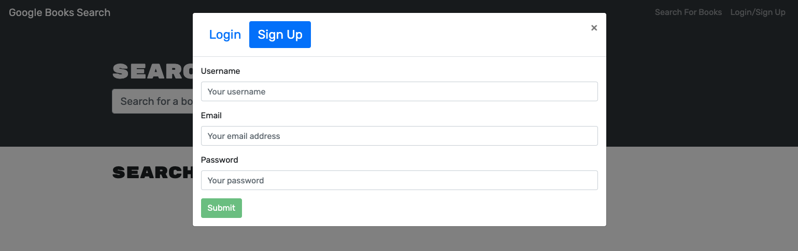
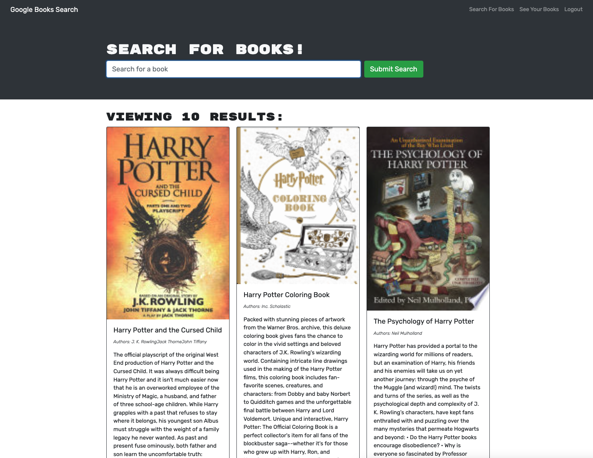

# Book Search

Github: https://github.com/patty345/book-search 

HerokuApp: https://book-search-65.herokuapp.com/ 

# Description

This project is a full stack web application that uses the MERN stack to allow users
to search books using the Google Search API.

# Usage

- Application allows users to search book with keywords
- Users are able to sign up by providing user name, email, and password
- Logged in users will abl eto save their favorite book as well as removed them.
- Saved bookd are stored in their account.

# Screenshots

# Technologies Used

- MongoDB
- Express.js
- React.js
- Node.js

